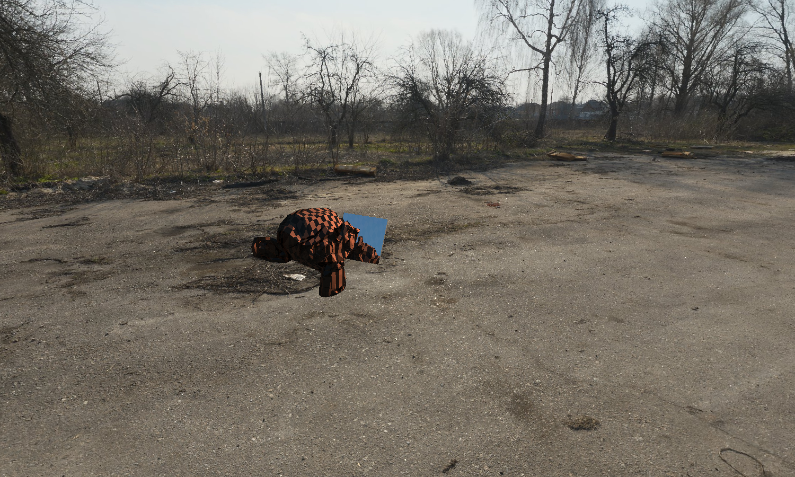
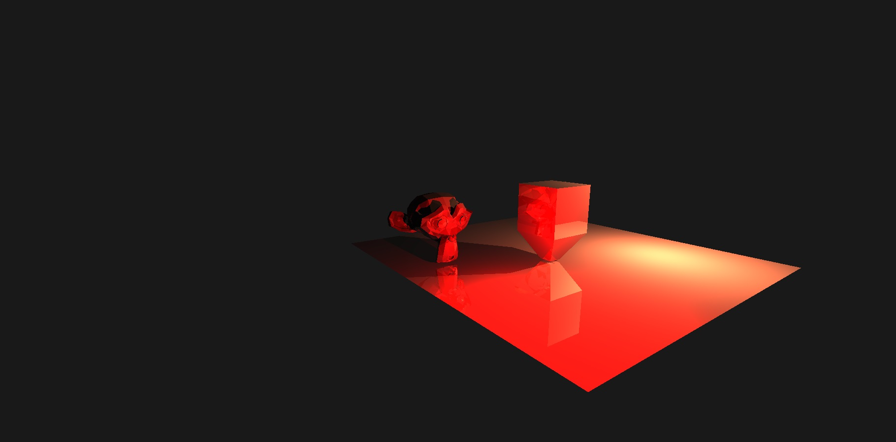
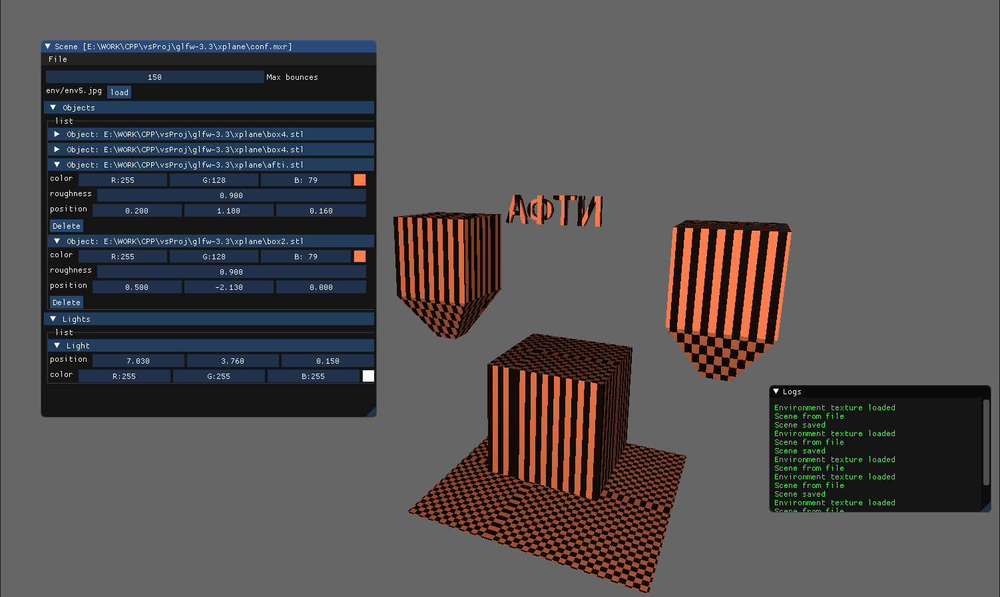

# Mixer3D
3D engine on OpenGL with custom raytracer

- scene configuration is loaded from conf.json file
- Environment maps are supported
- ["Dear IMGUI"](https://github.com/ocornut/imgui) interface
- Load/save scene and import .stl models
- Entity component system

GPU result

